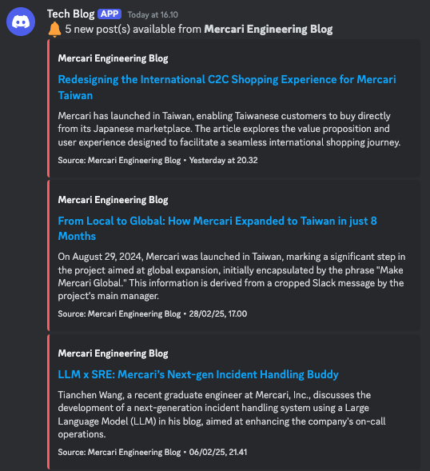

# SYNQR

> Sync what resonates. Cut through the noise, get what matters.

SYNQR is an open-source notification aggregator that helps you stay on top of
what matters most in 2025's overwhelming information landscape. Instead of
constantly checking multiple sources, SYNQR brings your important updates to you
in a clean, organized way.

## 🚀 Use Cases

### For K-Pop Fans

- Track your favorite idol's activities across platforms
- Never miss concert announcements or merchandise drops
- Get notified when multiple members hint at upcoming projects

### For Crypto Enthusiasts

- Monitor influencer sentiment about specific tokens
- Track market trends and community discussions
- Get alerts when multiple influencers discuss the same topic

### For Local Businesses

- Keep tabs on competitor changes
- Monitor customer sentiment across platforms
- Stay updated on local events and trends

## 🙏 Acknowledgments

- All our amazing contributors
- The open-source community
- Everyone who has given feedback and suggestions
